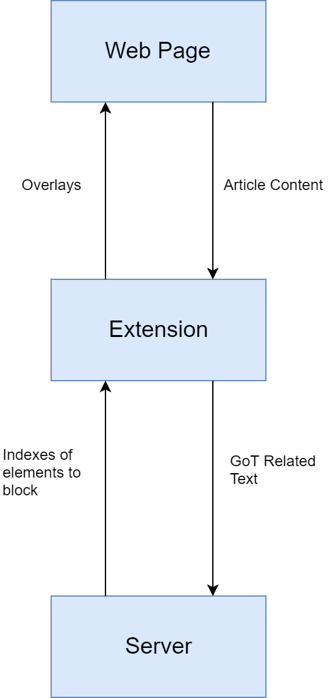

SpoilerAlert: Technical Specification

By David Early and Kevin McGonigle

## Table Of Contents

- 1. Introduction
   - 1.1 Glossary
- 2. System Architecture
- 3. High-Level Design
   - 3.1 State Diagram - Website
   - 3.2 Context Diagram
   - 3.2 Sequence Diagram - Block Spoilers
- 4. Problems and Resolution
   - 4.1 Quantity of Training Data
   - 4.2 Speed of IMDbPY
   - 4.3 Embedded Tweets
   - 4.4 Accurate Identification of GoT related Text
   - 4.5 Placement of overlays for dynamically loaded content
   - 4.6 Communication between the Front and Back Ends
   - 4.7 Reading in text/JSON file in JavaScript
- 5. User Installation

## 1. Introduction

The developed product is “SpoilerAlert”, a chrome extension that identifies and blocks
spoilers for the popular HBO series Game of Thrones(GoT) on the website joe.ie. It makes
use of Chrome development tools, JavaScript, JQuery, Python, combined with the use of
regular expressions, a server and Bayesian classification to perform various tasks to
complete blocking of text. A simple text file exists on the extension that contains a list of GoT
related keywords that we use to identify text that is related to GoT using regular expressions.
Upon finding text that contains these keywords, it is placed into a list of all text that is related
to GoT. The list is then sent to our server where we use python to tokenize and classify the
text. Our training data is contained in a csv file which, upon starting the server, is used to
train a multinomial Bayesian Classifier. The text is received and transformed into a numpy
array that the classifier can then understand and classify. In the case where the text is
classified as a spoiler, the index of the text is placed into a list. When all text has been
processed, the server sends back the list of indexes of elements, indicating where text
should be blocked.

The extension will then create an overlay for each piece of text that should be blocked,
place it in the right position and place a “reveal” button next to each overlay that allows users
to reveal the piece of text that was hidden. As well as that, upon clicking the SpoilerAlert
logo next to the search bar on the top right, a popup will be displayed along with a button
that, upon being clicked, removes all overlays that were placed by the extension. The
product does not interact with any external systems. It focuses on blocking text with minimal
delays to load times of pages. Our product processes text through two layers of
classification; related to GoT through the use of regular expressions in JavaScript and
Bayesian Classification in python. The intention is to be as accurate as possible with our
blocking but ultimately decided some false positives and negatives are to be expected.

### 1.1 Glossary

**GoT** ​: Game of Thrones.  

**MCU:** ​Marvel Cinematic Universe.  

**Bayes Theorem:** ​D​escribes the probability of an event, based on prior knowledge of
conditions that might be related to the event.  

**Sci-kit-learn(sklearn)** ​: The machine learning library in python used to train our Bayesian
Classifier.  

**Regular Expressions(RegEx):** ​A sequence of characters that define a search pattern for
strings.  

**IMDbPY:** ​An API that allows us to query the IMDb database from python.

## 2. System Architecture

_Web Page:_ ​The website that the user visits. In the case where this is a page on Joe.ie, the
product will begin the procedure of identifying GoT related text, sending text to the server
and creating appropriate overlays. Where this is any other web page, the extension will
simply do nothing.

_Extension:_ ​. This is where the website is identified and where the overlays are created using
JavaScript/JQuery. It acts as a aggregator of data both to and from the server in that it
collects data from the website and sends it to the server to be processed and it collects data
from the server to use in overlay creation.

_Server:_ ​This is where the process of classifying GoT related text into “spoilers” and
“non-spoilers”. Upon starting the server, a multivariate naive Bayes classifier is instantiated
and trained using the data in a csv file located on the server. Upon receiving text from the
extension, it is transformed into ‘classifier readable data’ and labelled “spoiler” or
“non-spoiler”. The index of the text is then placed into a list. When all text has been
processed, the list of indices is returned to the extension where it can block the correct
overlays.

## 3. High-Level Design

### 3.1 State Diagram - Website

### 3.2 Context Diagram

### 3.2 Sequence Diagram - Block Spoilers

## 4. Problems and Resolution

### 4.1 Quantity of Training Data

One of the biggest issues faced over the course of the development of the product was the
amount of spoiler data we could use to train up the Bayesian classifier. This was a point of
discussion for us and our supervisor almost since the start of the project. Our original idea
was to build a neural network, however considering the amount of data available for us and
under the guidance of our supervisor, we decided to use a naive Bayesian classifier instead.
As well as that, sourcing the data was an issue as well, since there is no universal definition
of what a spoiler is in the context of a specific show. Each person can have a differing
opinion on whether or not a specific piece of text is a spoiler. This ambiguity and subjectivity
meant that we had to find a source of data where each individual piece of text was
definitively labelled as a “spoiler”. We found that Reddit suited this need quite well. On the
GoT subreddit, each post is tagged as a spoiler by placing “[SPOILERS]” at the start of the
post’s title, a convention that is rigidly upheld by the moderators of the subreddit. Thus we
scraped almost a thousand posts that were tagged as spoilers using a Reddit Scraping API.

We also scraped Wikipedia and gameofthrones.fandom.net for some “non-spoilers”, since
this is text that is related to GoT but quite clearly not spoilers. It provides information about
the world and production of GoT instead of plot points, which certainly lead us to some
inaccuracies in our classification but provided a good starting point. As well as that, we used
some movie reviews as “non-spoilers” for GoT which finally gave us quite an accurate
classification of text.

### 4.2 Speed of IMDbPY

The speed of the IMDbPY API proved to be an issue for us. One of our main concerns about
the extension was the speed at which it operated and how much it would affect loading the
page and thus, after running some test code to examine the efficiency of IMDbPY, we
concluded that it was too slow for our purposes. A simple script that was designed to get all
actors from 10 MCU films ended up taking over thirty seconds which is much too long. After
consultation with our supervisor, we decided to focus exclusively Game of Thrones, since
there is a complete dataset available on Github that is frequently updated manually and we
will have no need to consult external datasets to classify data.

### 4.3 Embedded Tweets

Another issue that we faced was how to handle the blocking of embedded tweets that are
found in some of the articles on joe.ie. The problem here is that tweets are initially a simple
blockquote structure when the HTML DOM is loaded and thus our overlay was being placed
using the dimensions and positions of said blockquote. However, joe.ie made use of the
twitter widget API which dynamically and asynchronously replaced this blockquote with a

more complex twitter-widget element. Crucially, this meant that the size and placement of
the text within the tweet and our overlay would no longer be covering it.
There was much investigation into how to solve this problem. We attempted to prevent the
widget API from running by deleting it from the DOM and by changing the blockquote’s
class, but to no avail. We had hoped that our solution for handling dynamic addition of
elements into the DOM (as discussed in section 4.5 of this document) would remedy this, but
the MutationObserver interface did not recognise the widget’s activity as a mutation. As a
result of this, we opted to ignore tweets.

A side-effect of the tweets being replaced and thus their dimensions and placements being
changed was that the positions of any other elements that appeared after the tweet would
also be altered after we had already placed the overlays. At the time, the overlays were
absolutely positioned and would remain in the same place despite the text beneath them
moving. Our solution to this was to wrap our overlay and the element being blocked in a
wrapper div with relative positioning, such that if the text moves for any reason, the overlay
would move with it.

### 4.4 Accurate Identification of GoT related Text

One further issue was rapid and accurate identification of GoT related text using JavaScript.
We could have simply simply sent all text to the server where it can be processed using
Python, however, we decided that in order to reduce the load sent and processed by the
server, we used regular expressions and a list of GoT related keywords to determine
whether text is related to GoT. One of our top priorities was to ensure that the speed of
loading a page was not disturbed by our extension. Our previous method of identifying
keywords was to simply iterate through our list of keywords and see if any of them were in
the text under examination, which initially yielded good results. However, through unit testing
we found that sub-words were identified as GoT related e.g “robb” in the context of “Robb
Stark”, one of the show’s main characters, was found in the word “robbed”, meaning that text
that contains the word “robbed” was identified as GoT related. We thus turned to regular
expressions to look for word boundaries in the text which solved the issue for us.

### 4.5 Placement of overlays for dynamically loaded content

Previously, all our blocking would be done in one go as soon as the DOM was loaded and
our content script had been injected. This worked for the most part, however a significant
number of websites (including joe.ie) will dynamically insert, remove and alter content in
the DOM at any point in time using various scripts. This was a problem, as any content that
was added would not be interpreted and handled by our extension. To account for this, we
implemented a MutationObservor, a javascript interface which can be instructed to track
changes that are made to the DOM and react accordingly. With this implementation and
some refactoring, the extension now observes any changes and deals with added nodes as
it would the rest of the document during the original scan.

### 4.6 Communication between the Front and Back Ends

A fundamental function of our system is the ability to send textual data from the front end to
a back end server and for the back end to reply with some form of indication of which
spoilers to block. Implementing a solution for this proved to be difficult with much
experimentation and research required. Most notably, due to the nature of how Google
Chrome handles mixed content, we were unable to send data using HTTP when connected
to a website using HTTPS. To remedy this, we had to obtain a trusted, CA-signed SSL
certificate and configure our server to allow for communication over HTTPS.

### 4.7 Reading in text/JSON file in JavaScript

After scraping all the data about Game of Thrones from online, we originally decided to keep
our keywords in a text file that our content.js file could read in. However we quickly realized
that JavaScript is not capable of this functionality and thus experimented with using JSON
files instead but to no avail. We finally decided that we would keep our keywords as a
constant variable inside content.js. We realize that this is not good practice and it is true that
we are sacrificing some ease of extendability through this, however it is a simple solution to
a problem that was hindering further development and, if we were to continue development,
this is something that we would revisit.

## 5. User Installation

1. Go to this link in Google Chrome:
    https://chrome.google.com/webstore/detail/spoileralert/ocdndfdompohemjkmjjlhoacjjbknfia
2. Click the “Add to Chrome” button on the right hand side.
3. Click “Add extension”

The extension is now added to chrome and is ready for use. No special software,
components, hardware etc. are required.
