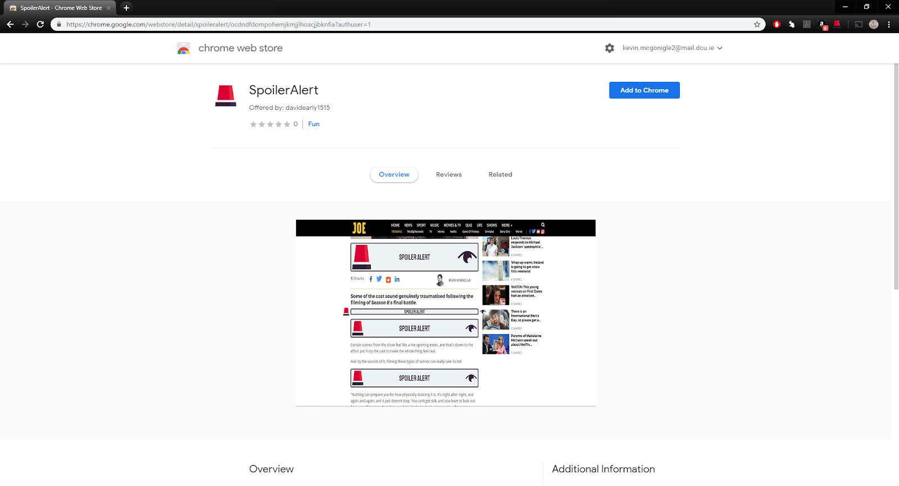
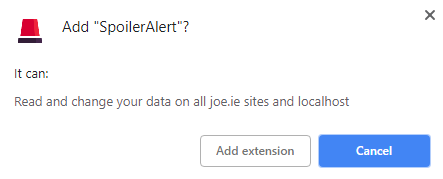
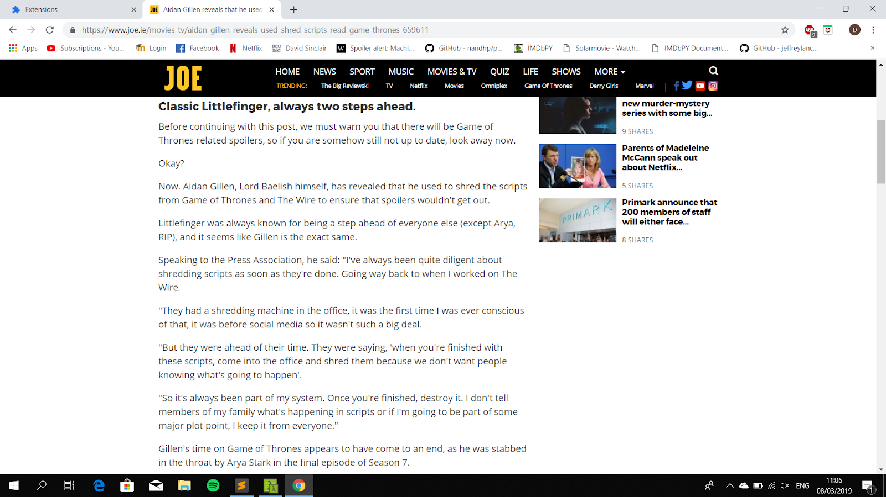
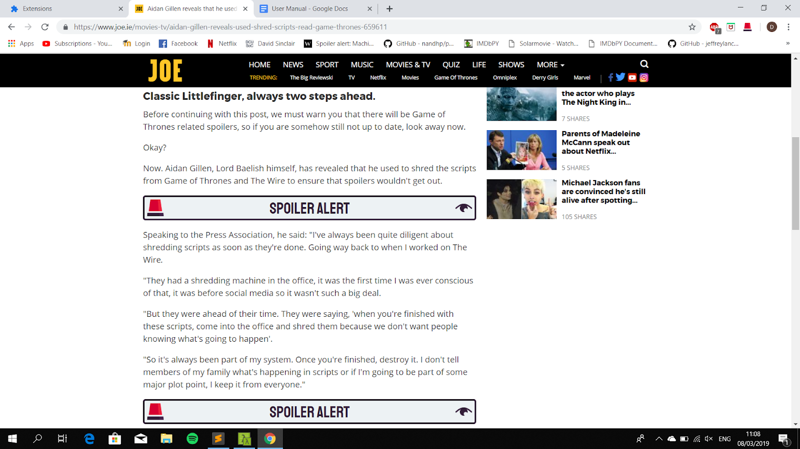
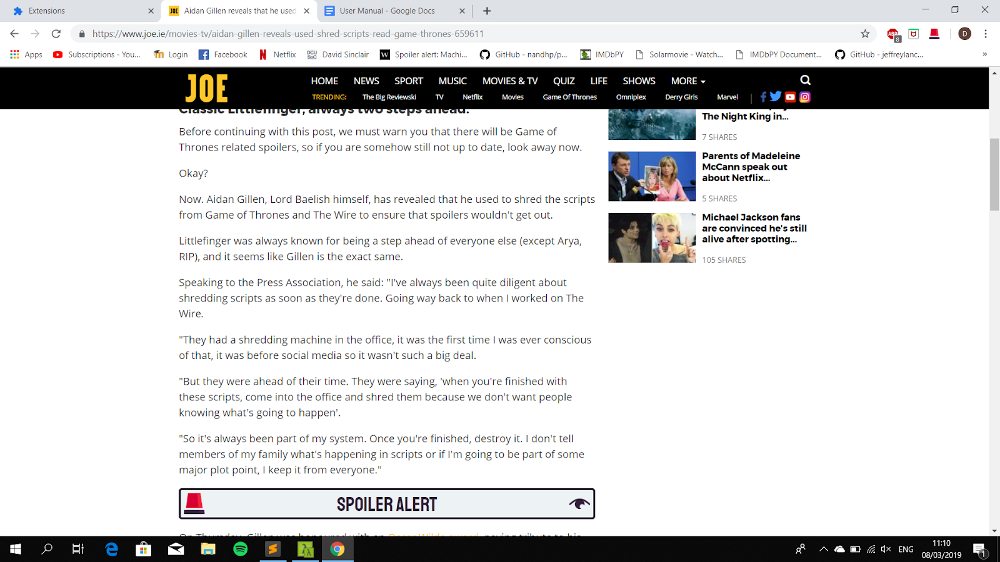
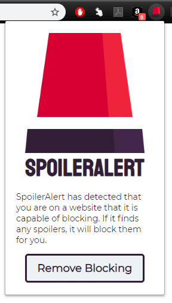

# SpoilerAlert: User Manual

By David Early and Kevin McGonigle

## Table of Contents

- Introduction to SpoilerAlert
- Installing SpoilerAlert
- Using SpoilerAlert
   - Automatic Spoiler Blocking
   - Revealing an Individual Spoiler
   - Revealing All Spoilers

## Introduction to SpoilerAlert

SpoilerAlert is a Google Chrome Extension designed to hide text-based “spoilers” found in a
web page^1 for the popular HBO television series, Game of Thrones.

## Installing SpoilerAlert

In order to install SpoilerAlert to Google Chrome, visit
https://chrome.google.com/webstore/detail/spoileralert/ocdndfdompohemjkmjjlhoacjjbknfia​.
You will be brought to the page below.

Clicking “Add to Chrome” will display the following pop-up. Click “Add-extension” to proceed
and install SpoilerAlert as an extension to your Google Chrome application.

(^1) At present, SpoilerAlert is only capable of operating on web pages on the joe.ie website.

## Using SpoilerAlert

### Automatic Spoiler Blocking

SpoilerAlert will automatically scan the web page you are currently on, locate potential
spoilers and subsequently hide these spoilers using an overlay.
For example, below is a screenshot of an article from Joe.ie containing spoilers about the
fate of Littlefinger over the course of the show. Upon examination of the text, it is clear that
there are phrases that would spoil the show for someone who is not up to date.

SpoilerAlert will automatically analyse this page while it is being loaded and place overlays
over the text that it determines to contain a spoiler. The result of this is displayed below.

### Revealing an Individual Spoiler

Should you wish to reveal the text that has been hidden beneath an overlay, this can be
achieved by clicking the reveal button (i.e. The “eye” icon on the right-hand side of the
overlay).

The following image shows this feature, using the same example as above. Here, the user
has chosen to hide the topmost overlay by clicking the reveal button. The overlay has been
removed and the text beneath is revealed.

### Revealing All Spoilers

If you wish to remove all overlays on a page in one go, this can be done by first clicking the
extension’s icon, found in the top-right corner of the Google Chrome browser, to the right of
the search bar. The following popup will be displayed.

Clicking the “Remove Blocking” button will remove all overlays that currently reside on the
web page, revealing all spoilers that were previously hidden.
